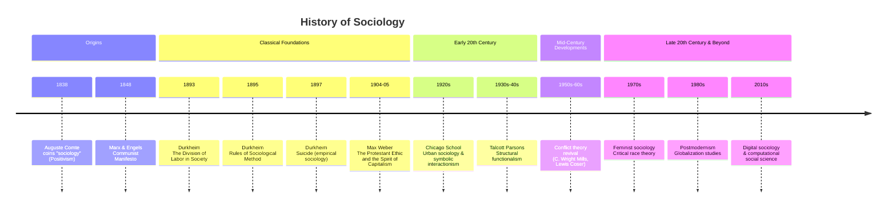

```mermaid
timeline
    title History of Sociology
    section Origins
      1838 : Auguste Comte<br>coins "sociology" (Positivism)
      1848 : Marx & Engels<br>Communist Manifesto
    section Classical Foundations
      1893 : Durkheim<br>The Division of Labor in Society
      1895 : Durkheim<br>Rules of Sociological Method
      1897 : Durkheim<br>Suicide (empirical sociology)
      1904-05 : Max Weber<br>The Protestant Ethic and the Spirit of Capitalism
    section Early 20th Century
      1920s : Chicago School<br>Urban sociology & symbolic interactionism
      1930s-40s : Talcott Parsons<br>Structural functionalism
    section Mid‑Century Developments
      1950s-60s : Conflict theory revival<br>(C. Wright Mills, Lewis Coser)
    section Late 20th Century & Beyond
      1970s : Feminist sociology<br>Critical race theory
      1980s : Postmodernism<br>Globalization studies
      2010s : Digital sociology<br>& computational social science
```
