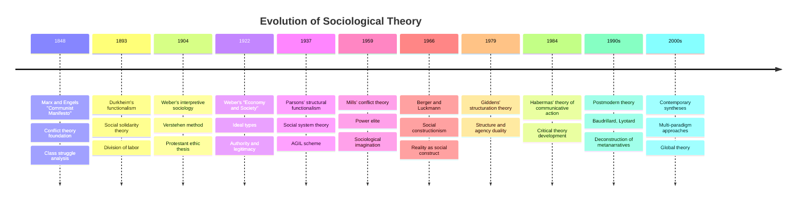

```mermaid
timeline
    title Evolution of Sociological Theory
    1848 : Marx and Engels "Communist Manifesto"
          : Conflict theory foundation
          : Class struggle analysis
    1893 : Durkheim's functionalism
          : Social solidarity theory
          : Division of labor
    1904 : Weber's interpretive sociology
          : Verstehen method
          : Protestant ethic thesis
    1922 : Weber's "Economy and Society"
          : Ideal types
          : Authority and legitimacy
    1937 : Parsons' structural functionalism
          : Social system theory
          : AGIL scheme
    1959 : Mills' conflict theory
          : Power elite
          : Sociological imagination
    1966 : Berger and Luckmann
          : Social constructionism
          : Reality as social construct
    1979 : Giddens' structuration theory
          : Structure and agency duality
    1984 : Habermas' theory of communicative action
          : Critical theory development
    1990s : Postmodern theory
          : Baudrillard, Lyotard
          : Deconstruction of metanarratives
    2000s : Contemporary syntheses
          : Multi-paradigm approaches
          : Global theory
```
