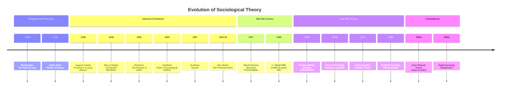

```mermaid
timeline
    title Evolution of Sociological Theory
    section Enlightenment Precursors
      1748 : Montesquieu<br>The Spirit of Laws
      1776 : Adam Smith<br>Wealth of Nations
    section Classical Foundations
      1838 : Auguste Comte<br>Positivism & social physics
      1848 : Marx & Engels<br>Communist Manifesto
      1893 : Durkheim<br>The Division of Labor
      1895 : Durkheim<br>Rules of Sociological Method
      1897 : Durkheim<br>Suicide
      1904-05 : Max Weber<br>The Protestant Ethic
    section Mid‑20th Century
      1937 : Talcott Parsons<br>Structural Functionalism
      1959 : C. Wright Mills<br>Conflict & power elite
    section Late 20th Century
      1959 : Erving Goffman<br>Symbolic Interactionism
      1970s : Feminist Sociology<br>Patriarchy & gender
      1972 : Pierre Bourdieu<br>Practice Theory
      1989 : Kimberlé Crenshaw<br>Intersectionality
    section Contemporary
      1990s : Actor‑Network Theory<br>Latour & Callon
      2000s : Digital Sociology<br>Globalization
```
