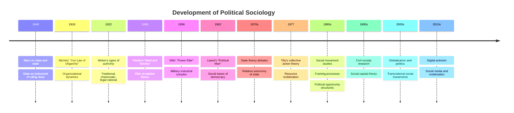

```mermaid
timeline
    title Development of Political Sociology
    1848 : Marx on class and state
          : State as instrument of ruling class
    1916 : Michels' "Iron Law of Oligarchy"
          : Organizational dynamics
    1922 : Weber's types of authority
          : Traditional, charismatic, legal-rational
    1936 : Pareto's "Mind and Society"
          : Elite circulation theory
    1956 : Mills' "Power Elite"
          : Military-industrial complex
    1962 : Lipset's "Political Man"
          : Social bases of democracy
    1970s : State theory debates
          : Relative autonomy of state
    1977 : Tilly's collective action theory
          : Resource mobilization
    1980s : Social movement studies
          : Framing processes
          : Political opportunity structures
    1990s : Civil society research
          : Social capital theory
    2000s : Globalization and politics
          : Transnational social movements
    2010s : Digital activism
          : Social media and mobilization
```
