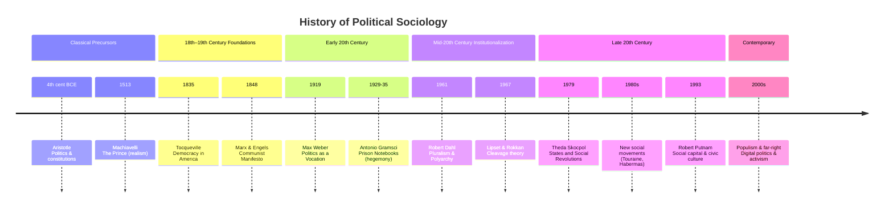

```mermaid
timeline
    title History of Political Sociology
    section Classical Precursors
      4th cent BCE : Aristotle<br>Politics & constitutions
      1513 : Machiavelli<br>The Prince (realism)
    section 18th–19th Century Foundations
      1835 : Tocqueville<br>Democracy in America
      1848 : Marx & Engels<br>Communist Manifesto
    section Early 20th Century
      1919 : Max Weber<br>Politics as a Vocation
      1929‑35 : Antonio Gramsci<br>Prison Notebooks (hegemony)
    section Mid‑20th Century Institutionalization
      1961 : Robert Dahl<br>Pluralism & Polyarchy
      1967 : Lipset & Rokkan<br>Cleavage theory
    section Late 20th Century
      1979 : Theda Skocpol<br>States and Social Revolutions
      1980s : New social movements<br>(Touraine, Habermas)
      1993 : Robert Putnam<br>Social capital & civic culture
    section Contemporary
      2000s : Populism & far-right<br>Digital politics & activism
```
