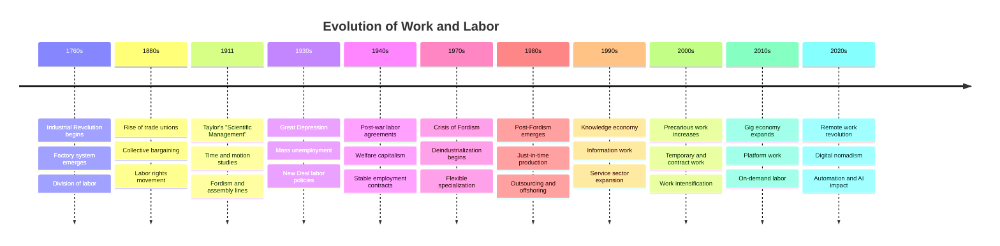

```mermaid
timeline
    title Evolution of Work and Labor
    1760s : Industrial Revolution begins
          : Factory system emerges
          : Division of labor
    1880s : Rise of trade unions
          : Collective bargaining
          : Labor rights movement
    1911 : Taylor's "Scientific Management"
          : Time and motion studies
          : Fordism and assembly lines
    1930s : Great Depression
          : Mass unemployment
          : New Deal labor policies
    1940s : Post-war labor agreements
          : Welfare capitalism
          : Stable employment contracts
    1970s : Crisis of Fordism
          : Deindustrialization begins
          : Flexible specialization
    1980s : Post-Fordism emerges
          : Just-in-time production
          : Outsourcing and offshoring
    1990s : Knowledge economy
          : Information work
          : Service sector expansion
    2000s : Precarious work increases
          : Temporary and contract work
          : Work intensification
    2010s : Gig economy expands
          : Platform work
          : On-demand labor
    2020s : Remote work revolution
          : Digital nomadism
          : Automation and AI impact
```
