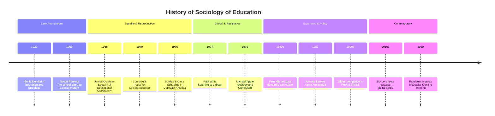

```mermaid
timeline
    title History of Sociology of Education
    section Early Foundations
      1922 : Émile Durkheim<br>Education and Sociology
      1959 : Talcott Parsons<br>The school class as a social system
    section Equality & Reproduction
      1966 : James Coleman<br>Equality of Educational Opportunity
      1970 : Bourdieu & Passeron<br>La Reproduction
      1976 : Bowles & Gintis<br>Schooling in Capitalist America
    section Critical & Resistance
      1977 : Paul Willis<br>Learning to Labour
      1979 : Michael Apple<br>Ideology and Curriculum
    section Expansion & Policy
      1980s : Feminist critiques<br>gendered curriculum
      1989 : Annette Lareau<br>Home Advantage
      2000s : Global comparisons<br>PISA & TIMSS
    section Contemporary
      2010s : School choice debates<br>digital divide
      2020 : Pandemic impacts<br>inequality & online learning
```
