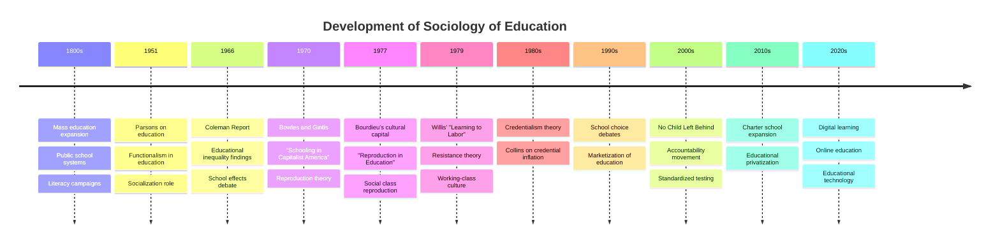

```mermaid
timeline
    title Development of Sociology of Education
    1800s : Mass education expansion
          : Public school systems
          : Literacy campaigns
    1951 : Parsons on education
          : Functionalism in education
          : Socialization role
    1966 : Coleman Report
          : Educational inequality findings
          : School effects debate
    1970 : Bowles and Gintis
          : "Schooling in Capitalist America"
          : Reproduction theory
    1977 : Bourdieu's cultural capital
          : "Reproduction in Education"
          : Social class reproduction
    1979 : Willis' "Learning to Labor"
          : Resistance theory
          : Working-class culture
    1980s : Credentialism theory
          : Collins on credential inflation
    1990s : School choice debates
          : Marketization of education
    2000s : No Child Left Behind
          : Accountability movement
          : Standardized testing
    2010s : Charter school expansion
          : Educational privatization
    2020s : Digital learning
          : Online education
          : Educational technology
```
