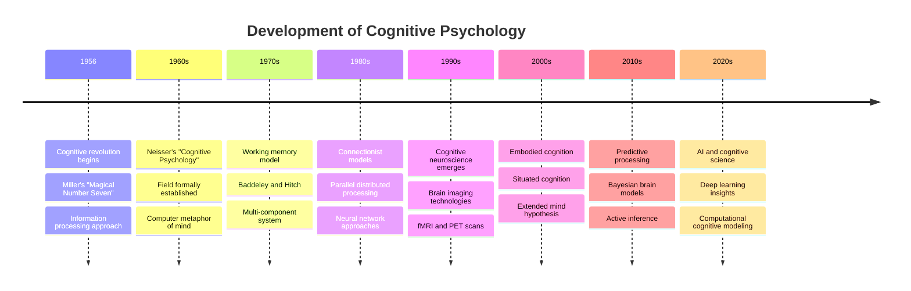

```mermaid
timeline
    title Development of Cognitive Psychology
    1956 : Cognitive revolution begins
          : Miller's "Magical Number Seven"
          : Information processing approach
    1960s : Neisser's "Cognitive Psychology"
          : Field formally established
          : Computer metaphor of mind
    1970s : Working memory model
          : Baddeley and Hitch
          : Multi-component system
    1980s : Connectionist models
          : Parallel distributed processing
          : Neural network approaches
    1990s : Cognitive neuroscience emerges
          : Brain imaging technologies
          : fMRI and PET scans
    2000s : Embodied cognition
          : Situated cognition
          : Extended mind hypothesis
    2010s : Predictive processing
          : Bayesian brain models
          : Active inference
    2020s : AI and cognitive science
          : Deep learning insights
          : Computational cognitive modeling
```
