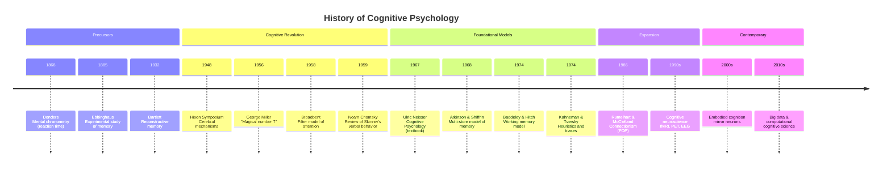

```mermaid
timeline
    title History of Cognitive Psychology
    section Precursors
      1868 : Donders<br>Mental chronometry (reaction time)
      1885 : Ebbinghaus<br>Experimental study of memory
      1932 : Bartlett<br>Reconstructive memory
    section Cognitive Revolution
      1948 : Hixon Symposium<br>Cerebral mechanisms
      1956 : George Miller<br>"Magical number 7"
      1958 : Broadbent<br>Filter model of attention
      1959 : Noam Chomsky<br>Review of Skinner's verbal behavior
    section Foundational Models
      1967 : Ulric Neisser<br>Cognitive Psychology (textbook)
      1968 : Atkinson & Shiffrin<br>Multi-store model of memory
      1974 : Baddeley & Hitch<br>Working memory model
      1974 : Kahneman & Tversky<br>Heuristics and biases
    section Expansion
      1986 : Rumelhart & McClelland<br>Connectionism (PDP)
      1990s : Cognitive neuroscience<br>fMRI, PET, EEG
    section Contemporary
      2000s : Embodied cognition<br>mirror neurons
      2010s : Big data & computational<br>cognitive science
```
