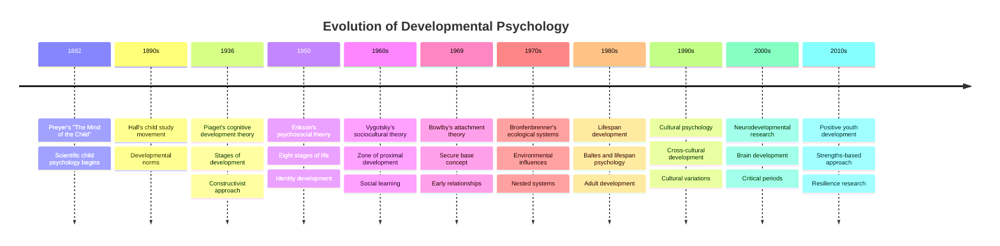

```mermaid
timeline
    title Evolution of Developmental Psychology
    1882 : Preyer's "The Mind of the Child"
          : Scientific child psychology begins
    1890s : Hall's child study movement
          : Developmental norms
    1936 : Piaget's cognitive development theory
          : Stages of development
          : Constructivist approach
    1950 : Erikson's psychosocial theory
          : Eight stages of life
          : Identity development
    1960s : Vygotsky's sociocultural theory
          : Zone of proximal development
          : Social learning
    1969 : Bowlby's attachment theory
          : Secure base concept
          : Early relationships
    1970s : Bronfenbrenner's ecological systems
          : Environmental influences
          : Nested systems
    1980s : Lifespan development
          : Baltes and lifespan psychology
          : Adult development
    1990s : Cultural psychology
          : Cross-cultural development
          : Cultural variations
    2000s : Neurodevelopmental research
          : Brain development
          : Critical periods
    2010s : Positive youth development
          : Strengths-based approach
          : Resilience research
```
