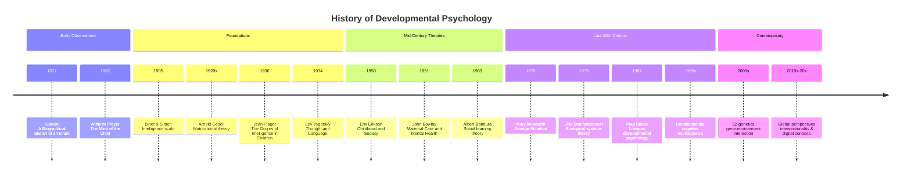

```mermaid
timeline
    title History of Developmental Psychology
    section Early Observations
      1877 : Darwin<br>A Biographical Sketch of an Infant
      1882 : Wilhelm Preyer<br>The Mind of the Child
    section Foundations
      1905 : Binet & Simon<br>Intelligence scale
      1920s : Arnold Gesell<br>Maturational theory
      1936 : Jean Piaget<br>The Origins of Intelligence in Children
      1934 : Lev Vygotsky<br>Thought and Language
    section Mid‑Century Theories
      1950 : Erik Erikson<br>Childhood and Society
      1951 : John Bowlby<br>Maternal Care and Mental Health
      1963 : Albert Bandura<br>Social learning theory
    section Late 20th Century
      1978 : Mary Ainsworth<br>Strange Situation
      1979 : Urie Bronfenbrenner<br>Ecological systems theory
      1987 : Paul Baltes<br>Lifespan developmental psychology
      1990s : Developmental cognitive neuroscience
    section Contemporary
      2000s : Epigenetics<br>gene‑environment interaction
      2010s‑20s : Global perspectives<br>intersectionality & digital contexts
```
