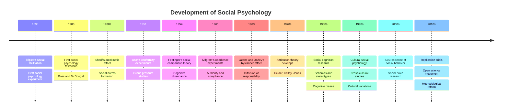

```mermaid
timeline
    title Development of Social Psychology
    1898 : Triplett's social facilitation
          : First social psychology experiment
    1908 : First social psychology textbooks
          : Ross and McDougall
    1930s : Sherif's autokinetic effect
          : Social norms formation
    1951 : Asch's conformity experiments
          : Group pressure studies
    1954 : Festinger's social comparison theory
          : Cognitive dissonance
    1961 : Milgram's obedience experiments
          : Authority and compliance
    1963 : Latane and Darley's bystander effect
          : Diffusion of responsibility
    1970s : Attribution theory develops
          : Heider, Kelley, Jones
    1980s : Social cognition research
          : Schemas and stereotypes
          : Cognitive biases
    1990s : Cultural social psychology
          : Cross-cultural studies
          : Cultural variations
    2000s : Neuroscience of social behavior
          : Social brain research
    2010s : Replication crisis
          : Open science movement
          : Methodological reform
```
