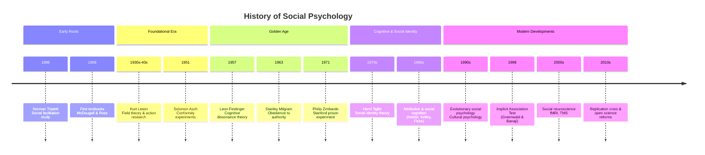

```mermaid
timeline
    title History of Social Psychology
    section Early Roots
      1898 : Norman Triplett<br>Social facilitation study
      1908 : First textbooks<br>McDougall & Ross
    section Foundational Era
      1930s-40s : Kurt Lewin<br>Field theory & action research
      1951 : Solomon Asch<br>Conformity experiments
    section Golden Age
      1957 : Leon Festinger<br>Cognitive dissonance theory
      1963 : Stanley Milgram<br>Obedience to authority
      1971 : Philip Zimbardo<br>Stanford prison experiment
    section Cognitive & Social Identity
      1970s : Henri Tajfel<br>Social identity theory
      1980s : Attribution & social cognition<br>(Heider, Kelley, Fiske)
    section Modern Developments
      1990s : Evolutionary social psychology<br>Cultural psychology
      1998 : Implicit Association Test<br>(Greenwald & Banaji)
      2000s : Social neuroscience<br>fMRI, TMS
      2010s : Replication crisis &<br>open science reforms
```
