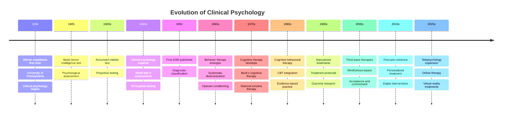

```mermaid
timeline
    title Evolution of Clinical Psychology
    1896 : Witmer establishes first clinic
          : University of Pennsylvania
          : Clinical psychology begins
    1905 : Binet-Simon intelligence test
          : Psychological assessment
    1920s : Rorschach inkblot test
          : Projective testing
    1940s : Clinical psychology expands
          : World War II assessments
          : VA hospital training
    1952 : First DSM published
          : Diagnostic classification
    1960s : Behavior therapy emerges
          : Systematic desensitization
          : Operant conditioning
    1970s : Cognitive therapy develops
          : Beck's cognitive therapy
          : Rational emotive therapy
    1980s : Cognitive-behavioral therapy
          : CBT integration
          : Evidence-based practice
    1990s : Manualized treatments
          : Treatment protocols
          : Outcome research
    2000s : Third-wave therapies
          : Mindfulness-based
          : Acceptance and commitment
    2010s : Precision medicine
          : Personalized treatment
          : Digital interventions
    2020s : Telepsychology expansion
          : Online therapy
          : Virtual reality treatments
```
