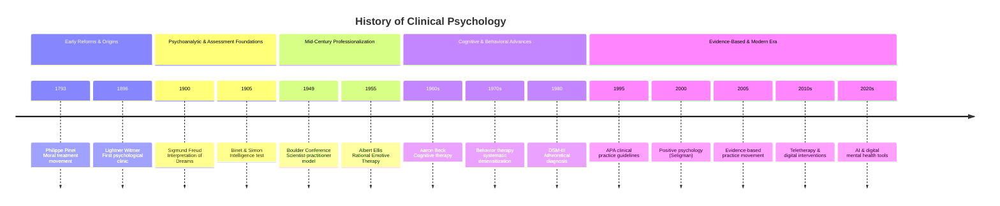

```mermaid
timeline
    title History of Clinical Psychology
    section Early Reforms & Origins
      1793 : Philippe Pinel<br>Moral treatment movement
      1896 : Lightner Witmer<br>First psychological clinic
    section Psychoanalytic & Assessment Foundations
      1900 : Sigmund Freud<br>Interpretation of Dreams
      1905 : Binet & Simon<br>Intelligence test
    section Mid‑Century Professionalization
      1949 : Boulder Conference<br>Scientist‑practitioner model
      1955 : Albert Ellis<br>Rational Emotive Therapy
    section Cognitive & Behavioral Advances
      1960s : Aaron Beck<br>Cognitive therapy
      1970s : Behavior therapy<br>systematic desensitization
      1980 : DSM‑III<br>Atheoretical diagnosis
    section Evidence‑Based & Modern Era
      1995 : APA clinical<br>practice guidelines
      2000 : Positive psychology<br>(Seligman)
      2005 : Evidence‑based<br>practice movement
      2010s : Teletherapy &<br>digital interventions
      2020s : AI & digital<br>mental health tools
```
