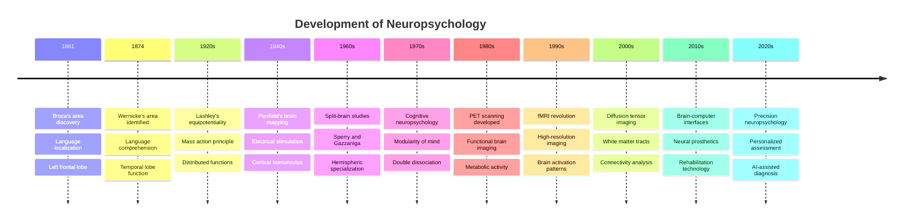

```mermaid
timeline
    title Development of Neuropsychology
    1861 : Broca's area discovery
          : Language localization
          : Left frontal lobe
    1874 : Wernicke's area identified
          : Language comprehension
          : Temporal lobe function
    1920s : Lashley's equipotentiality
          : Mass action principle
          : Distributed functions
    1940s : Penfield's brain mapping
          : Electrical stimulation
          : Cortical homunculus
    1960s : Split-brain studies
          : Sperry and Gazzaniga
          : Hemispheric specialization
    1970s : Cognitive neuropsychology
          : Modularity of mind
          : Double dissociation
    1980s : PET scanning developed
          : Functional brain imaging
          : Metabolic activity
    1990s : fMRI revolution
          : High-resolution imaging
          : Brain activation patterns
    2000s : Diffusion tensor imaging
          : White matter tracts
          : Connectivity analysis
    2010s : Brain-computer interfaces
          : Neural prosthetics
          : Rehabilitation technology
    2020s : Precision neuropsychology
          : Personalized assessment
          : AI-assisted diagnosis
```
