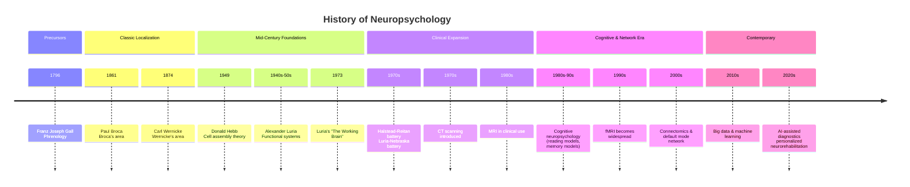

```mermaid
timeline
    title History of Neuropsychology
    section Precursors
      1796 : Franz Joseph Gall<br>Phrenology
    section Classic Localization
      1861 : Paul Broca<br>Broca's area
      1874 : Carl Wernicke<br>Wernicke's area
    section Mid‑Century Foundations
      1949 : Donald Hebb<br>Cell assembly theory
      1940s-50s : Alexander Luria<br>Functional systems
      1973 : Luria's "The Working Brain"
    section Clinical Expansion
      1970s : Halstead‑Reitan battery<br>Luria‑Nebraska battery
      1970s : CT scanning introduced
      1980s : MRI in clinical use
    section Cognitive & Network Era
      1980s-90s : Cognitive neuropsychology<br>(reading models, memory models)
      1990s : fMRI becomes widespread
      2000s : Connectomics & default mode network
    section Contemporary
      2010s : Big data & machine learning
      2020s : AI‑assisted diagnostics<br>personalized neurorehabilitation
```
