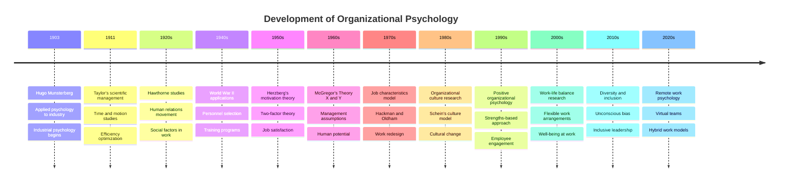

```mermaid
timeline
    title Development of Organizational Psychology
    1903 : Hugo Munsterberg
          : Applied psychology to industry
          : Industrial psychology begins
    1911 : Taylor's scientific management
          : Time and motion studies
          : Efficiency optimization
    1920s : Hawthorne studies
          : Human relations movement
          : Social factors in work
    1940s : World War II applications
          : Personnel selection
          : Training programs
    1950s : Herzberg's motivation theory
          : Two-factor theory
          : Job satisfaction
    1960s : McGregor's Theory X and Y
          : Management assumptions
          : Human potential
    1970s : Job characteristics model
          : Hackman and Oldham
          : Work redesign
    1980s : Organizational culture research
          : Schein's culture model
          : Cultural change
    1990s : Positive organizational psychology
          : Strengths-based approach
          : Employee engagement
    2000s : Work-life balance research
          : Flexible work arrangements
          : Well-being at work
    2010s : Diversity and inclusion
          : Unconscious bias
          : Inclusive leadership
    2020s : Remote work psychology
          : Virtual teams
          : Hybrid work models
```
