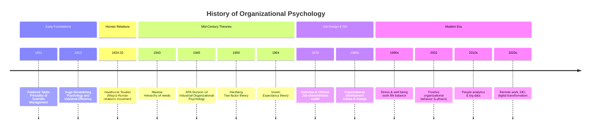

```mermaid
timeline
    title History of Organizational Psychology
    section Early Foundations
      1911 : Frederick Taylor<br>Principles of Scientific Management
      1913 : Hugo Münsterberg<br>Psychology and Industrial Efficiency
    section Human Relations
      1924-32 : Hawthorne Studies<br>(Mayo) Human relations movement
    section Mid‑Century Theories
      1943 : Maslow<br>Hierarchy of needs
      1945 : APA Division 14<br>Industrial-Organizational Psychology
      1959 : Herzberg<br>Two-factor theory
      1964 : Vroom<br>Expectancy theory
    section Job Design & OD
      1976 : Hackman & Oldham<br>Job characteristics model
      1980s : Organizational development<br>culture & change
    section Modern Era
      1990s : Stress & well-being<br>work-life balance
      2002 : Positive organizational<br>behavior (Luthans)
      2010s : People analytics<br>& big data
      2020s : Remote work, DEI,<br>digital transformation
```
