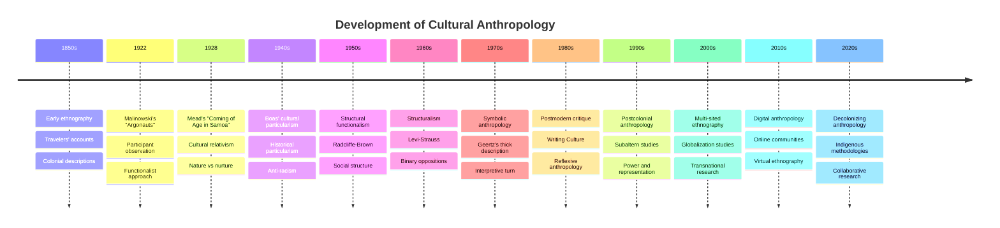

```mermaid
timeline
    title Development of Cultural Anthropology
    1850s : Early ethnography
          : Travelers' accounts
          : Colonial descriptions
    1922 : Malinowski's "Argonauts"
          : Participant observation
          : Functionalist approach
    1928 : Mead's "Coming of Age in Samoa"
          : Cultural relativism
          : Nature vs nurture
    1940s : Boas' cultural particularism
          : Historical particularism
          : Anti-racism
    1950s : Structural functionalism
          : Radcliffe-Brown
          : Social structure
    1960s : Structuralism
          : Levi-Strauss
          : Binary oppositions
    1970s : Symbolic anthropology
          : Geertz's thick description
          : Interpretive turn
    1980s : Postmodern critique
          : Writing Culture
          : Reflexive anthropology
    1990s : Postcolonial anthropology
          : Subaltern studies
          : Power and representation
    2000s : Multi-sited ethnography
          : Globalization studies
          : Transnational research
    2010s : Digital anthropology
          : Online communities
          : Virtual ethnography
    2020s : Decolonizing anthropology
          : Indigenous methodologies
          : Collaborative research
```
