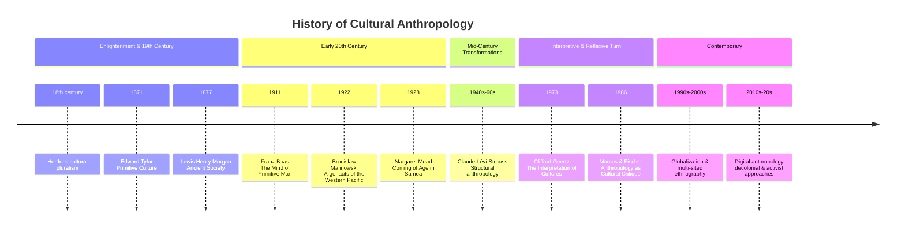

```mermaid
timeline
    title History of Cultural Anthropology
    section Enlightenment & 19th Century
      18th century : Herder's cultural pluralism
      1871 : Edward Tylor<br>Primitive Culture
      1877 : Lewis Henry Morgan<br>Ancient Society
    section Early 20th Century
      1911 : Franz Boas<br>The Mind of Primitive Man
      1922 : Bronisław Malinowski<br>Argonauts of the Western Pacific
      1928 : Margaret Mead<br>Coming of Age in Samoa
    section Mid‑Century Transformations
      1940s‑60s : Claude Lévi‑Strauss<br>Structural anthropology
    section Interpretive & Reflexive Turn
      1973 : Clifford Geertz<br>The Interpretation of Cultures
      1986 : Marcus & Fischer<br>Anthropology as Cultural Critique
    section Contemporary
      1990s‑2000s : Globalization &<br>multi‑sited ethnography
      2010s‑20s : Digital anthropology<br>decolonial & activist approaches
```
