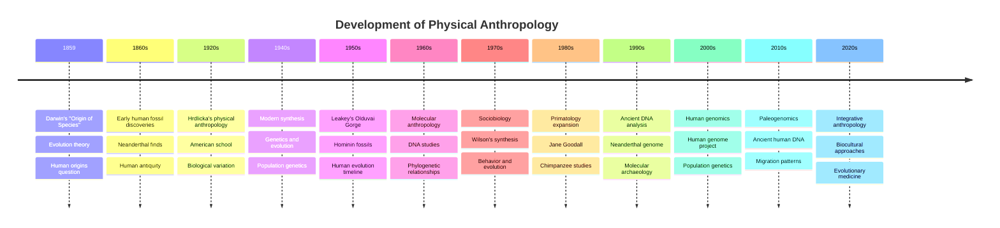

```mermaid
timeline
    title Development of Physical Anthropology
    1859 : Darwin's "Origin of Species"
          : Evolution theory
          : Human origins question
    1860s : Early human fossil discoveries
          : Neanderthal finds
          : Human antiquity
    1920s : Hrdlicka's physical anthropology
          : American school
          : Biological variation
    1940s : Modern synthesis
          : Genetics and evolution
          : Population genetics
    1950s : Leakey's Olduvai Gorge
          : Hominin fossils
          : Human evolution timeline
    1960s : Molecular anthropology
          : DNA studies
          : Phylogenetic relationships
    1970s : Sociobiology
          : Wilson's synthesis
          : Behavior and evolution
    1980s : Primatology expansion
          : Jane Goodall
          : Chimpanzee studies
    1990s : Ancient DNA analysis
          : Neanderthal genome
          : Molecular archaeology
    2000s : Human genomics
          : Human genome project
          : Population genetics
    2010s : Paleogenomics
          : Ancient human DNA
          : Migration patterns
    2020s : Integrative anthropology
          : Biocultural approaches
          : Evolutionary medicine
```
