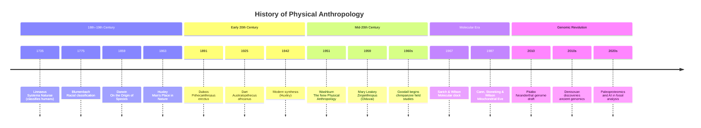

```mermaid
timeline
    title History of Physical Anthropology
    section 18th–19th Century
      1735 : Linnaeus<br>Systema Naturae (classifies humans)
      1775 : Blumenbach<br>Racial classification
      1859 : Darwin<br>On the Origin of Species
      1863 : Huxley<br>Man's Place in Nature
    section Early 20th Century
      1891 : Dubois<br>Pithecanthropus erectus
      1925 : Dart<br>Australopithecus africanus
      1942 : Modern synthesis<br>(Huxley)
    section Mid‑20th Century
      1951 : Washburn<br>The New Physical Anthropology
      1959 : Mary Leakey<br>Zinjanthropus (Olduvai)
      1960s : Goodall begins<br>chimpanzee field studies
    section Molecular Era
      1967 : Sarich & Wilson<br>Molecular clock
      1987 : Cann, Stoneking & Wilson<br>Mitochondrial Eve
    section Genomic Revolution
      2010 : Pääbo<br>Neanderthal genome draft
      2010s : Denisovan discoveries<br>ancient genomics
      2020s : Paleoproteomics<br>and AI in fossil analysis
```
