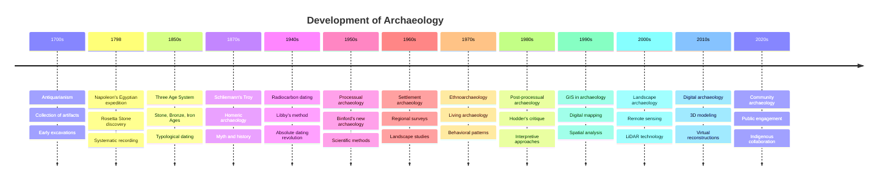

```mermaid
timeline
    title Development of Archaeology
    1700s : Antiquarianism
          : Collection of artifacts
          : Early excavations
    1798 : Napoleon's Egyptian expedition
          : Rosetta Stone discovery
          : Systematic recording
    1850s : Three Age System
          : Stone, Bronze, Iron Ages
          : Typological dating
    1870s : Schliemann's Troy
          : Homeric archaeology
          : Myth and history
    1940s : Radiocarbon dating
          : Libby's method
          : Absolute dating revolution
    1950s : Processual archaeology
          : Binford's new archaeology
          : Scientific methods
    1960s : Settlement archaeology
          : Regional surveys
          : Landscape studies
    1970s : Ethnoarchaeology
          : Living archaeology
          : Behavioral patterns
    1980s : Post-processual archaeology
          : Hodder's critique
          : Interpretive approaches
    1990s : GIS in archaeology
          : Digital mapping
          : Spatial analysis
    2000s : Landscape archaeology
          : Remote sensing
          : LiDAR technology
    2010s : Digital archaeology
          : 3D modeling
          : Virtual reconstructions
    2020s : Community archaeology
          : Public engagement
          : Indigenous collaboration
```
