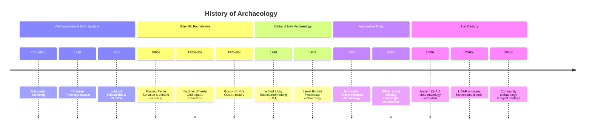

```mermaid
timeline
    title History of Archaeology
    section Antiquarianism & Early Systems
      17th-18th c : Antiquarian collecting
      1836 : Thomsen<br>Three-age system
      1865 : Lubbock<br>Palaeolithic & Neolithic
    section Scientific Foundations
      1890s : Flinders Petrie<br>Seriation & context recording
      1920s-30s : Mortimer Wheeler<br>Grid‑square excavation
      1925-30s : Gordon Childe<br>Culture history
    section Dating & New Archaeology
      1949 : Willard Libby<br>Radiocarbon dating (C14)
      1962 : Lewis Binford<br>Processual archaeology
    section Interpretive Turns
      1986 : Ian Hodder<br>Post‑processual archaeology
      1990s : GIS & remote sensing<br>Landscape archaeology
    section 21st Century
      2000s : Ancient DNA &<br>bioarchaeology revolution
      2010s : LiDAR uncovers<br>hidden landscapes
      2020s : Community archaeology<br>& digital heritage
```
