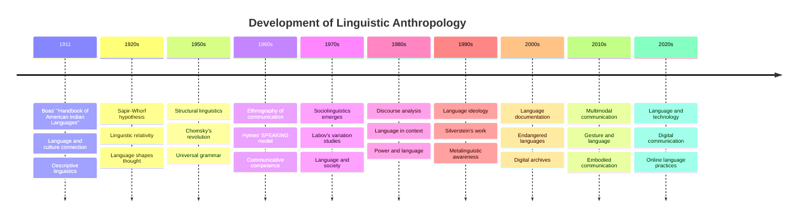

```mermaid
timeline
    title Development of Linguistic Anthropology
    1911 : Boas' "Handbook of American Indian Languages"
          : Language and culture connection
          : Descriptive linguistics
    1920s : Sapir-Whorf hypothesis
          : Linguistic relativity
          : Language shapes thought
    1950s : Structural linguistics
          : Chomsky's revolution
          : Universal grammar
    1960s : Ethnography of communication
          : Hymes' SPEAKING model
          : Communicative competence
    1970s : Sociolinguistics emerges
          : Labov's variation studies
          : Language and society
    1980s : Discourse analysis
          : Language in context
          : Power and language
    1990s : Language ideology
          : Silverstein's work
          : Metalinguistic awareness
    2000s : Language documentation
          : Endangered languages
          : Digital archives
    2010s : Multimodal communication
          : Gesture and language
          : Embodied communication
    2020s : Language and technology
          : Digital communication
          : Online language practices
```
