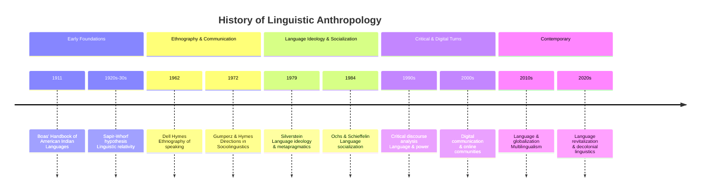

```mermaid
timeline
    title History of Linguistic Anthropology
    section Early Foundations
      1911 : Boas' Handbook of<br>American Indian Languages
      1920s-30s : Sapir-Whorf hypothesis<br>Linguistic relativity
    section Ethnography & Communication
      1962 : Dell Hymes<br>Ethnography of speaking
      1972 : Gumperz & Hymes<br>Directions in Sociolinguistics
    section Language Ideology & Socialization
      1979 : Silverstein<br>Language ideology & metapragmatics
      1984 : Ochs & Schieffelin<br>Language socialization
    section Critical & Digital Turns
      1990s : Critical discourse analysis<br>Language & power
      2000s : Digital communication<br>& online communities
    section Contemporary
      2010s : Language & globalization<br>Multilingualism
      2020s : Language revitalization<br>& decolonial linguistics
```
