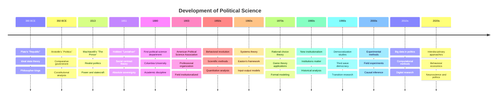

```mermaid
timeline
    title Development of Political Science
    380 BCE : Plato's "Republic"
          : Ideal state theory
          : Philosopher-kings
    350 BCE : Aristotle's "Politics"
          : Comparative government
          : Constitutional analysis
    1513 : Machiavelli's "The Prince"
          : Realist politics
          : Power and statecraft
    1651 : Hobbes' "Leviathan"
          : Social contract theory
          : Absolute sovereignty
    1880 : First political science department
          : Columbia University
          : Academic discipline
    1903 : American Political Science Association
          : Professional organization
          : Field institutionalized
    1950s : Behavioral revolution
          : Scientific methods
          : Quantitative analysis
    1960s : Systems theory
          : Easton's framework
          : Input-output models
    1970s : Rational choice theory
          : Game theory applications
          : Formal modeling
    1980s : New institutionalism
          : Institutions matter
          : Historical analysis
    1990s : Democratization studies
          : Third wave democracy
          : Transition research
    2000s : Experimental methods
          : Field experiments
          : Causal inference
    2010s : Big data in politics
          : Computational methods
          : Digital research
    2020s : Interdisciplinary approaches
          : Behavioral economics
          : Neuroscience and politics
```
