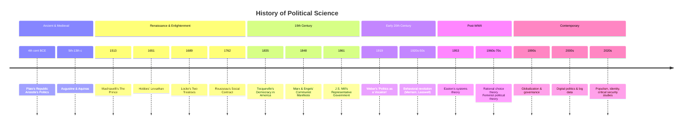

```mermaid
timeline
    title History of Political Science
    section Ancient & Medieval
      4th cent BCE : Plato's Republic<br>Aristotle's Politics
      5th-13th c : Augustine & Aquinas
    section Renaissance & Enlightenment
      1513 : Machiavelli's The Prince
      1651 : Hobbes' Leviathan
      1689 : Locke's Two Treatises
      1762 : Rousseau's Social Contract
    section 19th Century
      1835 : Tocqueville's Democracy in America
      1848 : Marx & Engels' Communist Manifesto
      1861 : J.S. Mill's Representative Government
    section Early 20th Century
      1919 : Weber's 'Politics as a Vocation'
      1920s‑50s : Behavioral revolution<br>(Merriam, Lasswell)
    section Post‑WWII
      1953 : Easton's systems theory
      1960s‑70s : Rational choice theory<br>Feminist political theory
    section Contemporary
      1990s : Globalization & governance
      2000s : Digital politics & big data
      2020s : Populism, identity,<br>critical security studies
```
