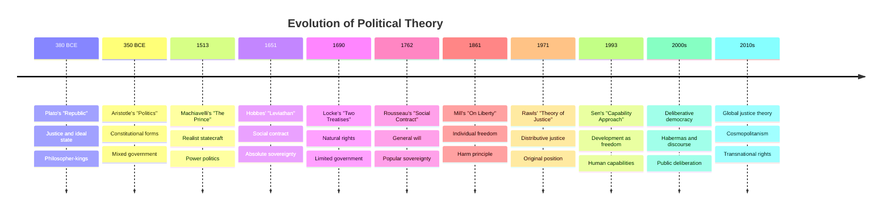

```mermaid
timeline
    title Evolution of Political Theory
    380 BCE : Plato's "Republic"
          : Justice and ideal state
          : Philosopher-kings
    350 BCE : Aristotle's "Politics"
          : Constitutional forms
          : Mixed government
    1513 : Machiavelli's "The Prince"
          : Realist statecraft
          : Power politics
    1651 : Hobbes' "Leviathan"
          : Social contract
          : Absolute sovereignty
    1690 : Locke's "Two Treatises"
          : Natural rights
          : Limited government
    1762 : Rousseau's "Social Contract"
          : General will
          : Popular sovereignty
    1861 : Mill's "On Liberty"
          : Individual freedom
          : Harm principle
    1971 : Rawls' "Theory of Justice"
          : Distributive justice
          : Original position
    1993 : Sen's "Capability Approach"
          : Development as freedom
          : Human capabilities
    2000s : Deliberative democracy
          : Habermas and discourse
          : Public deliberation
    2010s : Global justice theory
          : Cosmopolitanism
          : Transnational rights
```
