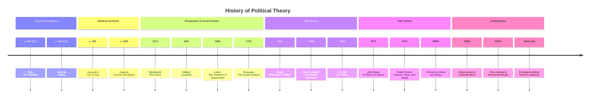

```mermaid
timeline
    title History of Political Theory
    section Ancient Foundations
      c. 380 BCE : Plato<br>The Republic
      c. 335 BCE : Aristotle<br>Politics
    section Medieval Synthesis
      c. 400 : Augustine<br>City of God
      c. 1260 : Aquinas<br>Summa Theologica
    section Renaissance & Social Contract
      1513 : Machiavelli<br>The Prince
      1651 : Hobbes<br>Leviathan
      1689 : Locke<br>Two Treatises of Government
      1762 : Rousseau<br>The Social Contract
    section 19th Century
      1821 : Hegel<br>Philosophy of Right
      1848 : Marx & Engels<br>Communist Manifesto
      1859 : J.S. Mill<br>On Liberty
    section 20th Century
      1971 : John Rawls<br>A Theory of Justice
      1974 : Robert Nozick<br>Anarchy, State, and Utopia
      1980s : Feminist & critical<br>race theory
    section Contemporary
      1990s : Global justice &<br>multiculturalism
      2000s : Post‑colonial &<br>decolonial thought
      2010s‑20s : Ecological political<br>theory & populism
```
