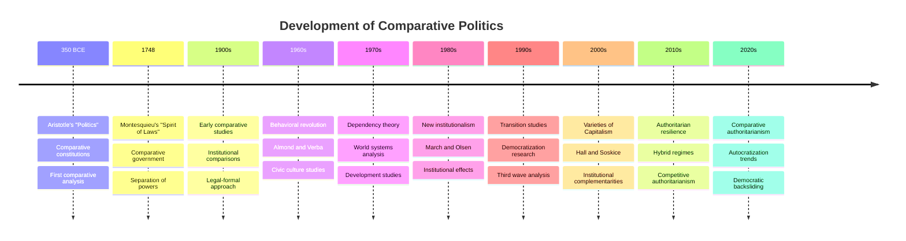

```mermaid
timeline
    title Development of Comparative Politics
    350 BCE : Aristotle's "Politics"
          : Comparative constitutions
          : First comparative analysis
    1748 : Montesquieu's "Spirit of Laws"
          : Comparative government
          : Separation of powers
    1900s : Early comparative studies
          : Institutional comparisons
          : Legal-formal approach
    1960s : Behavioral revolution
          : Almond and Verba
          : Civic culture studies
    1970s : Dependency theory
          : World systems analysis
          : Development studies
    1980s : New institutionalism
          : March and Olsen
          : Institutional effects
    1990s : Transition studies
          : Democratization research
          : Third wave analysis
    2000s : Varieties of Capitalism
          : Hall and Soskice
          : Institutional complementarities
    2010s : Authoritarian resilience
          : Hybrid regimes
          : Competitive authoritarianism
    2020s : Comparative authoritarianism
          : Autocratization trends
          : Democratic backsliding
```
