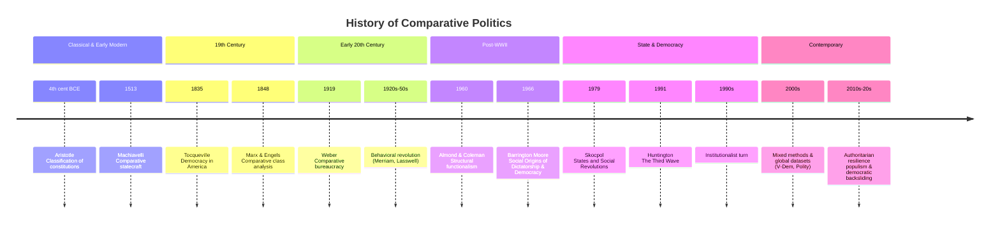

```mermaid
timeline
    title History of Comparative Politics
    section Classical & Early Modern
      4th cent BCE : Aristotle<br>Classification of constitutions
      1513 : Machiavelli<br>Comparative statecraft
    section 19th Century
      1835 : Tocqueville<br>Democracy in America
      1848 : Marx & Engels<br>Comparative class analysis
    section Early 20th Century
      1919 : Weber<br>Comparative bureaucracy
      1920s‑50s : Behavioral revolution<br>(Merriam, Lasswell)
    section Post‑WWII
      1960 : Almond & Coleman<br>Structural functionalism
      1966 : Barrington Moore<br>Social Origins of Dictatorship & Democracy
    section State & Democracy
      1979 : Skocpol<br>States and Social Revolutions
      1991 : Huntington<br>The Third Wave
      1990s : Institutionalist turn
    section Contemporary
      2000s : Mixed methods &<br>global datasets (V‑Dem, Polity)
      2010s‑20s : Authoritarian resilience<br>populism & democratic backsliding
```
