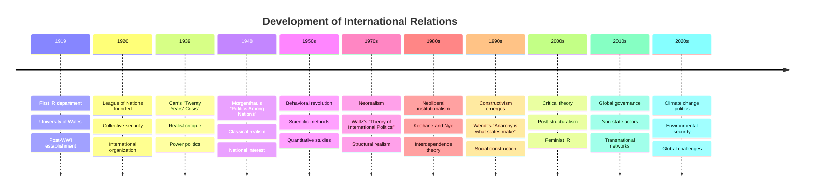

```mermaid
timeline
    title Development of International Relations
    1919 : First IR department
          : University of Wales
          : Post-WWI establishment
    1920 : League of Nations founded
          : Collective security
          : International organization
    1939 : Carr's "Twenty Years' Crisis"
          : Realist critique
          : Power politics
    1948 : Morgenthau's "Politics Among Nations"
          : Classical realism
          : National interest
    1950s : Behavioral revolution
          : Scientific methods
          : Quantitative studies
    1970s : Neorealism
          : Waltz's "Theory of International Politics"
          : Structural realism
    1980s : Neoliberal institutionalism
          : Keohane and Nye
          : Interdependence theory
    1990s : Constructivism emerges
          : Wendt's "Anarchy is what states make"
          : Social construction
    2000s : Critical theory
          : Post-structuralism
          : Feminist IR
    2010s : Global governance
          : Non-state actors
          : Transnational networks
    2020s : Climate change politics
          : Environmental security
          : Global challenges
```
