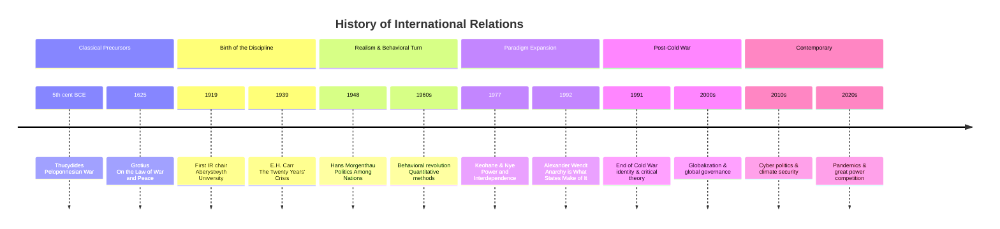

```mermaid
timeline
    title History of International Relations
    section Classical Precursors
      5th cent BCE : Thucydides<br>Peloponnesian War
      1625 : Grotius<br>On the Law of War and Peace
    section Birth of the Discipline
      1919 : First IR chair<br>Aberystwyth University
      1939 : E.H. Carr<br>The Twenty Years' Crisis
    section Realism & Behavioral Turn
      1948 : Hans Morgenthau<br>Politics Among Nations
      1960s : Behavioral revolution<br>Quantitative methods
    section Paradigm Expansion
      1977 : Keohane & Nye<br>Power and Interdependence
      1992 : Alexander Wendt<br>Anarchy is What States Make of It
    section Post‑Cold War
      1991 : End of Cold War<br>identity & critical theory
      2000s : Globalization &<br>global governance
    section Contemporary
      2010s : Cyber politics &<br>climate security
      2020s : Pandemics &<br>great power competition
```
