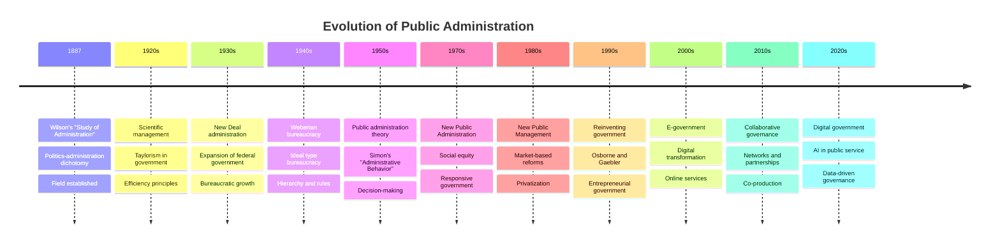

```mermaid
timeline
    title Evolution of Public Administration
    1887 : Wilson's "Study of Administration"
          : Politics-administration dichotomy
          : Field established
    1920s : Scientific management
          : Taylorism in government
          : Efficiency principles
    1930s : New Deal administration
          : Expansion of federal government
          : Bureaucratic growth
    1940s : Weberian bureaucracy
          : Ideal type bureaucracy
          : Hierarchy and rules
    1950s : Public administration theory
          : Simon's "Administrative Behavior"
          : Decision-making
    1970s : New Public Administration
          : Social equity
          : Responsive government
    1980s : New Public Management
          : Market-based reforms
          : Privatization
    1990s : Reinventing government
          : Osborne and Gaebler
          : Entrepreneurial government
    2000s : E-government
          : Digital transformation
          : Online services
    2010s : Collaborative governance
          : Networks and partnerships
          : Co-production
    2020s : Digital government
          : AI in public service
          : Data-driven governance
```
