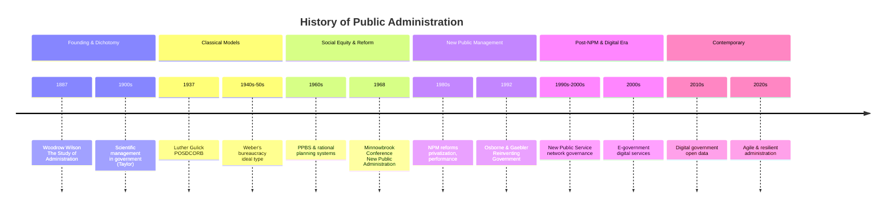

```mermaid
timeline
    title History of Public Administration
    section Founding & Dichotomy
      1887 : Woodrow Wilson<br>The Study of Administration
      1900s : Scientific management<br>in government (Taylor)
    section Classical Models
      1937 : Luther Gulick<br>POSDCORB
      1940s‑50s : Weber's bureaucracy<br>ideal type
    section Social Equity & Reform
      1960s : PPBS & rational<br>planning systems
      1968 : Minnowbrook Conference<br>New Public Administration
    section New Public Management
      1980s : NPM reforms<br>privatization, performance
      1992 : Osborne & Gaebler<br>Reinventing Government
    section Post‑NPM & Digital Era
      1990s‑2000s : New Public Service<br>network governance
      2000s : E‑government<br>digital services
    section Contemporary
      2010s : Digital government<br>open data
      2020s : Agile & resilient<br>administration
```
