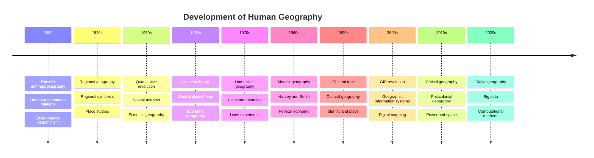

```mermaid
timeline
    title Development of Human Geography
    1882 : Ratzel's anthropogeography
          : Human-environment relations
          : Environmental determinism
    1920s : Regional geography
          : Regional synthesis
          : Place studies
    1950s : Quantitative revolution
          : Spatial analysis
          : Scientific geography
    1960s : Location theory
          : Central place theory
          : Economic geography
    1970s : Humanistic geography
          : Place and meaning
          : Lived experience
    1980s : Marxist geography
          : Harvey and Smith
          : Political economy
    1990s : Cultural turn
          : Cultural geography
          : Identity and place
    2000s : GIS revolution
          : Geographic information systems
          : Digital mapping
    2010s : Critical geography
          : Postcolonial geography
          : Power and space
    2020s : Digital geography
          : Big data
          : Computational methods
```
