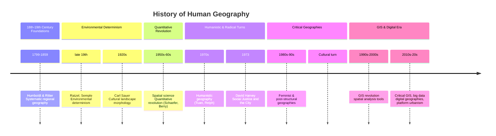

```mermaid
timeline
    title History of Human Geography
    section 18th‑19th Century Foundations
      1799‑1859 : Humboldt & Ritter<br>Systematic regional geography
    section Environmental Determinism
      late 19th : Ratzel, Semple<br>Environmental determinism
      1920s : Carl Sauer<br>Cultural landscape morphology
    section Quantitative Revolution
      1950s‑60s : Spatial science<br>Quantitative revolution (Schaefer, Berry)
    section Humanistic & Radical Turns
      1970s : Humanistic geography<br>(Tuan, Relph)
      1973 : David Harvey<br>Social Justice and the City
    section Critical Geographies
      1980s‑90s : Feminist & post‑structural<br>geographies
      Cultural turn
    section GIS & Digital Era
      1990s‑2000s : GIS revolution<br>spatial analysis tools
      2010s‑20s : Critical GIS, big data<br>digital geographies, platform urbanism
```
