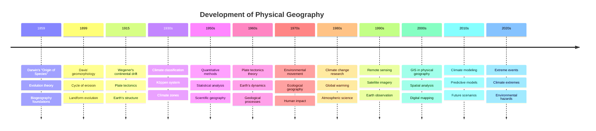

```mermaid
timeline
    title Development of Physical Geography
    1859 : Darwin's "Origin of Species"
          : Evolution theory
          : Biogeography foundations
    1899 : Davis' geomorphology
          : Cycle of erosion
          : Landform evolution
    1915 : Wegener's continental drift
          : Plate tectonics
          : Earth's structure
    1930s : Climate classification
          : Köppen system
          : Climate zones
    1950s : Quantitative methods
          : Statistical analysis
          : Scientific geography
    1960s : Plate tectonics theory
          : Earth's dynamics
          : Geological processes
    1970s : Environmental movement
          : Ecological geography
          : Human impact
    1980s : Climate change research
          : Global warming
          : Atmospheric science
    1990s : Remote sensing
          : Satellite imagery
          : Earth observation
    2000s : GIS in physical geography
          : Spatial analysis
          : Digital mapping
    2010s : Climate modeling
          : Predictive models
          : Future scenarios
    2020s : Extreme events
          : Climate extremes
          : Environmental hazards
```
