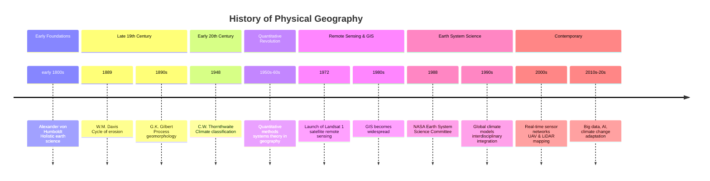

```mermaid
timeline
    title History of Physical Geography
    section Early Foundations
      early 1800s : Alexander von Humboldt<br>Holistic earth science
    section Late 19th Century
      1889 : W.M. Davis<br>Cycle of erosion
      1890s : G.K. Gilbert<br>Process geomorphology
    section Early 20th Century
      1948 : C.W. Thornthwaite<br>Climate classification
    section Quantitative Revolution
      1950s‑60s : Quantitative methods<br>systems theory in geography
    section Remote Sensing & GIS
      1972 : Launch of Landsat 1<br>satellite remote sensing
      1980s : GIS becomes<br>widespread
    section Earth System Science
      1988 : NASA Earth System<br>Science Committee
      1990s : Global climate models<br>interdisciplinary integration
    section Contemporary
      2000s : Real‑time sensor networks<br>UAV & LiDAR mapping
      2010s‑20s : Big data, AI,<br>climate change adaptation
```
