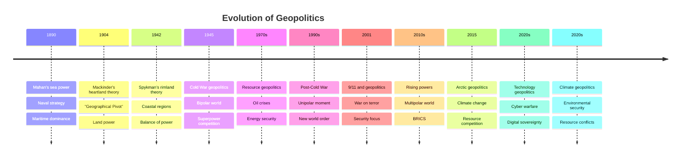

```mermaid
timeline
    title Evolution of Geopolitics
    1890 : Mahan's sea power
          : Naval strategy
          : Maritime dominance
    1904 : Mackinder's heartland theory
          : "Geographical Pivot"
          : Land power
    1942 : Spykman's rimland theory
          : Coastal regions
          : Balance of power
    1945 : Cold War geopolitics
          : Bipolar world
          : Superpower competition
    1970s : Resource geopolitics
          : Oil crises
          : Energy security
    1990s : Post-Cold War
          : Unipolar moment
          : New world order
    2001 : 9/11 and geopolitics
          : War on terror
          : Security focus
    2010s : Rising powers
          : Multipolar world
          : BRICS
    2015 : Arctic geopolitics
          : Climate change
          : Resource competition
    2020s : Technology geopolitics
          : Cyber warfare
          : Digital sovereignty
    2020s : Climate geopolitics
          : Environmental security
          : Resource conflicts
```
