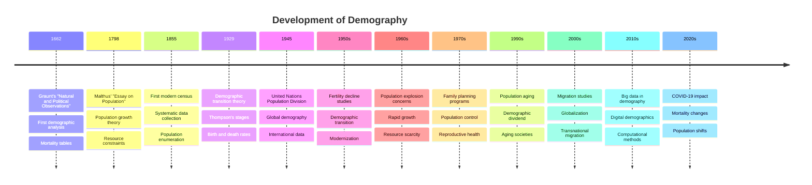

```mermaid
timeline
    title Development of Demography
    1662 : Graunt's "Natural and Political Observations"
          : First demographic analysis
          : Mortality tables
    1798 : Malthus' "Essay on Population"
          : Population growth theory
          : Resource constraints
    1855 : First modern census
          : Systematic data collection
          : Population enumeration
    1929 : Demographic transition theory
          : Thompson's stages
          : Birth and death rates
    1945 : United Nations Population Division
          : Global demography
          : International data
    1950s : Fertility decline studies
          : Demographic transition
          : Modernization
    1960s : Population explosion concerns
          : Rapid growth
          : Resource scarcity
    1970s : Family planning programs
          : Population control
          : Reproductive health
    1990s : Population aging
          : Demographic dividend
          : Aging societies
    2000s : Migration studies
          : Globalization
          : Transnational migration
    2010s : Big data in demography
          : Digital demographics
          : Computational methods
    2020s : COVID-19 impact
          : Mortality changes
          : Population shifts
```
