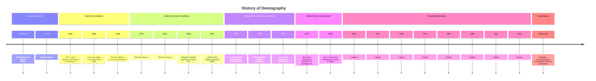

```mermaid
timeline
    title History of Demography
    section Early Enumerations
      c. 3800 BCE : Babylonian clay tablets<br>census
      c. 6 CE : Roman census
    section Scientific Foundations
      1662 : John Graunt<br>Natural and Political Observations
      1693 : Edmund Halley<br>First modern life table
      1798 : Thomas Malthus<br>Essay on Population
    section Modern Censuses & Statistics
      1790 : First US Census
      1801 : First UK Census
      1835 : Adolphe Quetelet<br>Statistical study of man
      1907 : Alfred Lotka<br>Stable population theory
    section Demographic Transition & Institutions
      1945 : Frank Notestein<br>Demographic transition model
      1946 : UN Population Division<br>established
      1954 : First World Population Conference
    section Global Policy & Development
      1974 : Bucharest Conference<br>population & development
      1994 : Cairo Conference<br>reproductive health & rights
    section Population Milestones
      1804 : 1 billion
      1927 : 2 billion
      1960 : 3 billion
      1974 : 4 billion
      1987 : 5 billion
      1999 : 6 billion
      2011 : 7 billion
      2022 : 8 billion
    section Contemporary
      2010s-20s : Big data, microsimulation,<br>and climate‑sensitive projections
```
