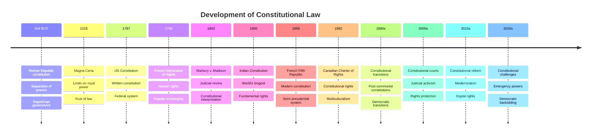

```mermaid
timeline
    title Development of Constitutional Law
    509 BCE : Roman Republic constitution
          : Separation of powers
          : Republican government
    1215 : Magna Carta
          : Limits on royal power
          : Rule of law
    1787 : US Constitution
          : Written constitution
          : Federal system
    1789 : French Declaration of Rights
          : Human rights
          : Popular sovereignty
    1803 : Marbury v. Madison
          : Judicial review
          : Constitutional interpretation
    1950 : Indian Constitution
          : World's longest
          : Fundamental rights
    1958 : French Fifth Republic
          : Modern constitution
          : Semi-presidential system
    1982 : Canadian Charter of Rights
          : Constitutional rights
          : Multiculturalism
    1990s : Constitutional transitions
          : Post-communist constitutions
          : Democratic transitions
    2000s : Constitutional courts
          : Judicial activism
          : Rights protection
    2010s : Constitutional reform
          : Modernization
          : Digital rights
    2020s : Constitutional challenges
          : Emergency powers
          : Democratic backsliding
```
