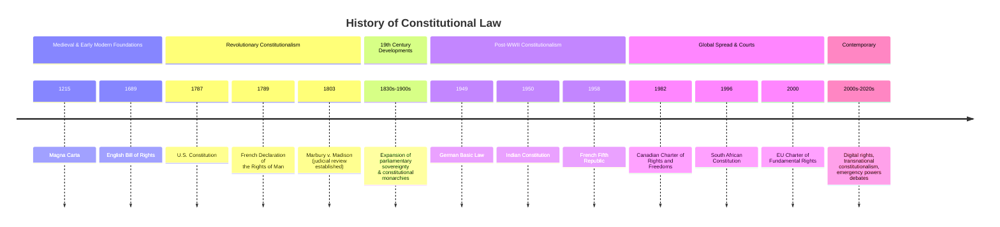

```mermaid
timeline
    title History of Constitutional Law
    section Medieval & Early Modern Foundations
      1215 : Magna Carta
      1689 : English Bill of Rights
    section Revolutionary Constitutionalism
      1787 : U.S. Constitution
      1789 : French Declaration of<br>the Rights of Man
      1803 : Marbury v. Madison<br>(judicial review established)
    section 19th Century Developments
      1830s-1900s : Expansion of<br>parliamentary sovereignty<br>& constitutional monarchies
    section Post‑WWII Constitutionalism
      1949 : German Basic Law
      1950 : Indian Constitution
      1958 : French Fifth Republic
    section Global Spread & Courts
      1982 : Canadian Charter of<br>Rights and Freedoms
      1996 : South African Constitution
      2000 : EU Charter of<br>Fundamental Rights
    section Contemporary
      2000s‑2020s : Digital rights,<br>transnational constitutionalism,<br>emergency powers debates
```
