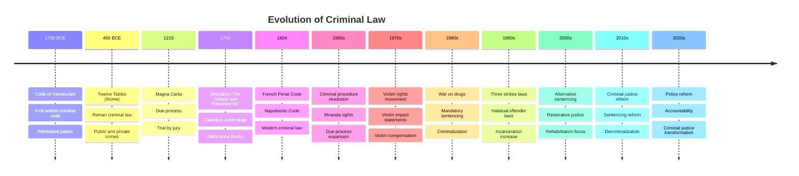

```mermaid
timeline
    title Evolution of Criminal Law
    1750 BCE : Code of Hammurabi
          : First written criminal code
          : Retributive justice
    450 BCE : Twelve Tables (Rome)
          : Roman criminal law
          : Public and private crimes
    1215 : Magna Carta
          : Due process
          : Trial by jury
    1764 : Beccaria's "On Crimes and Punishments"
          : Classical criminology
          : Deterrence theory
    1804 : French Penal Code
          : Napoleonic Code
          : Modern criminal law
    1960s : Criminal procedure revolution
          : Miranda rights
          : Due process expansion
    1970s : Victim rights movement
          : Victim impact statements
          : Victim compensation
    1980s : War on drugs
          : Mandatory sentencing
          : Criminalization
    1990s : Three strikes laws
          : Habitual offender laws
          : Incarceration increase
    2000s : Alternative sentencing
          : Restorative justice
          : Rehabilitation focus
    2010s : Criminal justice reform
          : Sentencing reform
          : Decriminalization
    2020s : Police reform
          : Accountability
          : Criminal justice transformation
```
