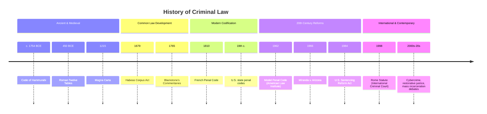

```mermaid
timeline
    title History of Criminal Law
    section Ancient & Medieval
      c. 1754 BCE : Code of Hammurabi
      450 BCE : Roman Twelve Tables
      1215 : Magna Carta
    section Common Law Development
      1679 : Habeas Corpus Act
      1765 : Blackstone's Commentaries
    section Modern Codification
      1810 : French Penal Code
      19th c. : U.S. state penal codes
    section 20th Century Reforms
      1962 : Model Penal Code<br>(American Law Institute)
      1966 : Miranda v. Arizona
      1984 : U.S. Sentencing Reform Act
    section International & Contemporary
      1998 : Rome Statute<br>(International Criminal Court)
      2000s‑20s : Cybercrime,<br>restorative justice,<br>mass incarceration debates
```
