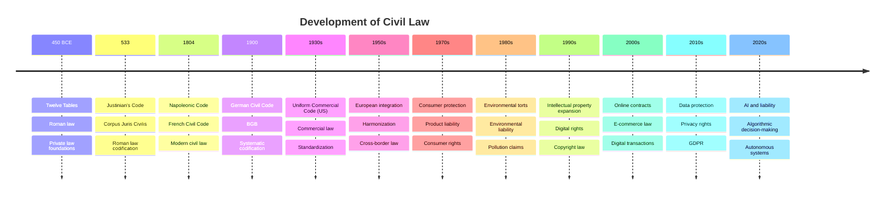

```mermaid
timeline
    title Development of Civil Law
    450 BCE : Twelve Tables
          : Roman law
          : Private law foundations
    533 : Justinian's Code
          : Corpus Juris Civilis
          : Roman law codification
    1804 : Napoleonic Code
          : French Civil Code
          : Modern civil law
    1900 : German Civil Code
          : BGB
          : Systematic codification
    1930s : Uniform Commercial Code (US)
          : Commercial law
          : Standardization
    1950s : European integration
          : Harmonization
          : Cross-border law
    1970s : Consumer protection
          : Product liability
          : Consumer rights
    1980s : Environmental torts
          : Environmental liability
          : Pollution claims
    1990s : Intellectual property expansion
          : Digital rights
          : Copyright law
    2000s : Online contracts
          : E-commerce law
          : Digital transactions
    2010s : Data protection
          : Privacy rights
          : GDPR
    2020s : AI and liability
          : Algorithmic decision-making
          : Autonomous systems
```
